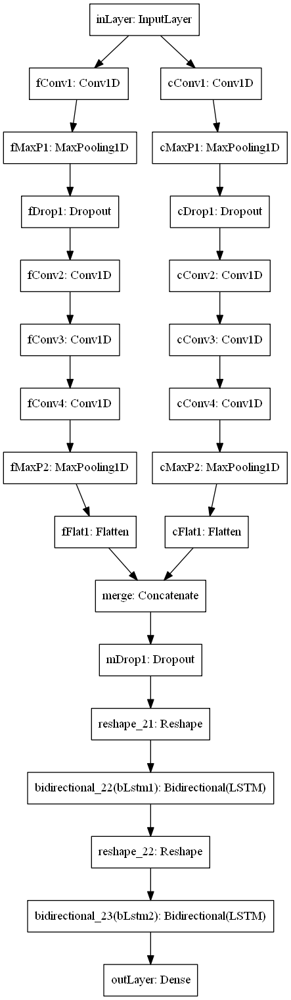

This is an implementation of DeepSleepNet as described in [Supratak et. al 2017](https://www.researchgate.net/publication/314942973_DeepSleepNet_a_Model_for_Automatic_Sleep_Stage_Scoring_based_on_Raw_Single-Channel_EEG) using Keras+Tensorflow.

### Model summary

The top part of the neural network employs two parallel deep convolutional networks, one on left tries to learn fine temporal features, whereas the one on the right tries to learn coarse temporal features. Features learnt in ultimate layers is concatenated and fed into two Bidirectional LSTM layers [Supratak et. al 2017](https://www.researchgate.net/publication/314942973_DeepSleepNet_a_Model_for_Automatic_Sleep_Stage_Scoring_based_on_Raw_Single-Channel_EEG).

